# Medical Device Log RAG Chatbot - System Sequence Diagram

## Complete System Flow Sequence Diagram

```mermaid
sequenceDiagram
    participant User as 👤 User
    participant CLI as 💻 Terminal CLI
    participant QP as 🔍 Query Parser
    participant QR as 🚦 Query Router
    participant MQ as 🗄️ MongoDB Query Engine
    participant VS as 🔍 Vector Search Service
    participant OLL as 🤖 Ollama Service
    participant DB as 📊 MongoDB Database
    participant VI as 🧮 Vector Index

    Note over User,VI: === INITIALIZATION PHASE ===
    User->>CLI: Start chatbot (node chatbot.js)
    CLI->>CLI: Initialize readline interface
    CLI->>CLI: Load environment variables
    CLI->>CLI: Display welcome message
    CLI->>User: Show prompt: "🧠 You: "

    Note over User,VI: === MAIN INTERACTION LOOP ===
    loop User Interaction Loop
        User->>CLI: Enter query/question
        CLI->>QP: Parse user input
        QP->>QP: Classify query type
        
        alt Direct Query (Structured)
            QP->>QR: Route to direct query handler
            QR->>QR: Extract fields and filters
            QR->>MQ: Execute MongoDB query
            MQ->>DB: Find documents with filters
            DB->>MQ: Return filtered results
            MQ->>QR: Format results
            QR->>CLI: Display tabular results
            CLI->>User: Show formatted table
            
        else Natural Language Query (RAG)
            QP->>QR: Route to RAG query handler
            QR->>OLL: Generate embedding for query
            OLL->>OLL: Convert text to vector
            OLL->>QR: Return query embedding
            QR->>VS: Perform vector search
            VS->>VI: Search similar vectors
            VI->>VS: Return top 15 similar logs
            VS->>DB: Fetch full log documents
            DB->>VS: Return log details
            VS->>QR: Format context from logs
            QR->>OLL: Generate response with context
            OLL->>OLL: Process with Mistral model
            OLL->>QR: Return natural language answer
            QR->>CLI: Format response
            CLI->>User: Display AI-generated answer
            
        else Special Commands
            QP->>QR: Route to special command handler
            alt Show Logs Command
                QR->>MQ: Execute show logs query
                MQ->>DB: Find all logs with filters
                DB->>MQ: Return log documents
                MQ->>QR: Format JSON output
                QR->>CLI: Display detailed logs
                CLI->>User: Show JSON formatted logs
            else Unique Values Command
                QR->>MQ: Execute distinct query
                MQ->>DB: Get unique field values
                DB->>MQ: Return unique values
                MQ->>QR: Format unique values
                QR->>CLI: Display unique values
                CLI->>User: Show list of unique values
            end
        end
        
        CLI->>User: Show prompt: "🧠 You: "
    end

    Note over User,VI: === ERROR HANDLING ===
    alt Error in Query Processing
        QP->>CLI: Handle parsing error
        CLI->>User: Display error message
    else Error in Database Query
        MQ->>QR: Handle database error
        QR->>CLI: Display database error
        CLI->>User: Show error message
    else Error in Ollama Service
        OLL->>QR: Handle AI service error
        QR->>CLI: Display AI error
        CLI->>User: Show error message
    end

    Note over User,VI: === EXIT PROCESS ===
    User->>CLI: Type "exit" or "q"
    CLI->>CLI: Close database connections
    CLI->>CLI: Cleanup resources
    CLI->>User: Display goodbye message
```

## Data Ingestion Flow Sequence Diagram

```mermaid
sequenceDiagram
    participant Admin as 👨‍💼 Administrator
    participant IS as 📥 Ingestion Script
    participant DB as 📊 MongoDB Database
    participant OLL as 🤖 Ollama Service
    participant VI as 🧮 Vector Index

    Note over Admin,VI: === DATA INGESTION PROCESS ===
    Admin->>IS: Run ingest-logs.js
    IS->>IS: Load environment variables
    IS->>IS: Initialize MongoDB connection
    
    IS->>DB: Find logs without embeddings
    DB->>IS: Return unprocessed logs
    
    loop For Each Log Document
        IS->>IS: Extract text from log
        Note right of IS: Combine DeviceId, Summary,<br/>Description, State, etc.
        
        IS->>OLL: Generate embedding for text
        OLL->>OLL: Convert text to 768-dim vector
        OLL->>IS: Return embedding vector
        
        IS->>DB: Update log with embedding
        DB->>VI: Index embedding in vector index
        VI->>DB: Confirm indexing
        
        IS->>IS: Log progress
        Note right of IS: "✅ Embedded and updated: {log_id}"
    end
    
    IS->>IS: Log completion status
    IS->>Admin: Display final count
    Note right of IS: "🎉 Done. Total embedded: {count}"
    
    IS->>IS: Close database connection
```

## Vector Search Detailed Flow

```mermaid
sequenceDiagram
    participant User as 👤 User
    participant CLI as 💻 Terminal CLI
    participant QR as 🚦 Query Router
    participant OLL as 🤖 Ollama Service
    participant VS as 🔍 Vector Search
    participant DB as 📊 MongoDB Database
    participant VI as 🧮 Vector Index

    Note over User,VI: === VECTOR SEARCH PROCESS ===
    User->>CLI: Ask natural language question
    CLI->>QR: Process RAG query
    
    QR->>OLL: Generate query embedding
    OLL->>OLL: Convert question to vector
    OLL->>QR: Return query embedding
    
    QR->>VS: Perform vector similarity search
    VS->>VI: Search with query vector
    Note right of VI: numCandidates: 100<br/>similarity: cosine<br/>limit: 15
    
    VI->>VS: Return top 15 similar vectors
    VS->>DB: Fetch full documents for vectors
    DB->>VS: Return log documents
    
    VS->>QR: Format context from logs
    Note right of QR: Format: DeviceId, Summary,<br/>State, Model, Ward, Timestamp
    
    QR->>OLL: Generate response with context
    OLL->>OLL: Process with Mistral model
    Note right of OLL: Prompt: "You are an assistant<br/>helping debug medical device logs..."
    
    OLL->>QR: Return natural language answer
    QR->>CLI: Format response
    CLI->>User: Display AI-generated answer
```

## Direct Query Flow

## Error Handling Flow

```mermaid
sequenceDiagram
    participant User as 👤 User
    participant CLI as 💻 Terminal CLI
    participant QP as 🔍 Query Parser
    participant QR as 🚦 Query Router
    participant MQ as 🗄️ MongoDB Query Engine
    participant OLL as 🤖 Ollama Service
    participant DB as 📊 MongoDB Database

    Note over User,DB: === ERROR HANDLING SCENARIOS ===
    
    alt Database Connection Error
        MQ->>QR: Connection failed
        QR->>CLI: Handle connection error
        CLI->>User: "❌ Error: Cannot connect to database"
        
    else Ollama Service Error
        OLL->>QR: Service unavailable
        QR->>CLI: Handle AI service error
        CLI->>User: "❌ Error: AI service not responding"
        
    else Query Parsing Error
        QP->>CLI: Invalid query format
        CLI->>User: "🤖 Please specify fields to list (e.g. 'list deviceid and model')"
        
    else No Results Found
        DB->>MQ: Empty result set
        MQ->>QR: No matching logs
        QR->>CLI: Handle empty results
        CLI->>User: "🤖 No matching logs found."
        
    else Vector Search Error
        QR->>OLL: Embedding generation failed
        OLL->>QR: Embedding error
        QR->>CLI: Handle embedding error
        CLI->>User: "❌ Error: Could not process your question"
    end
    
    CLI->>User: Show prompt: "🧠 You: "
```

## System Architecture Overview

## Performance Metrics Flow

```mermaid
sequenceDiagram
    participant User as 👤 User
    participant CLI as 💻 Terminal CLI
    participant QP as 🔍 Query Parser
    participant QR as 🚦 Query Router
    participant MQ as 🗄️ MongoDB Query Engine
    participant VS as 🔍 Vector Search Service
    participant OLL as 🤖 Ollama Service
    participant DB as 📊 MongoDB Database

    Note over User,DB: === PERFORMANCE MONITORING ===
    
    User->>CLI: Enter query
    CLI->>QP: Start timing
    QP->>QP: Parse query (5-10ms)
    QP->>QR: Route query
    
    alt Direct Query Path
        QR->>MQ: Execute query
        MQ->>DB: Database query (20-50ms)
        DB->>MQ: Return results
        MQ->>QR: Format results (5-10ms)
        QR->>CLI: Total time: ~50-100ms
        
    else RAG Query Path
        QR->>OLL: Generate embedding
        OLL->>QR: Embedding (200-500ms)
        QR->>VS: Vector search
        VS->>DB: Similarity search (100-300ms)
        DB->>VS: Return similar logs
        VS->>QR: Format context (10-20ms)
        QR->>OLL: Generate response
        OLL->>QR: LLM response (300-1000ms)
        QR->>CLI: Total time: ~800-2000ms
    end
    
    CLI->>User: Display results with timing
```

## Security and Authentication Flow

```mermaid
sequenceDiagram
    participant User as 👤 User
    participant CLI as 💻 Terminal CLI
    participant AUTH as 🔐 Authentication Service
    participant DB as 📊 MongoDB Database
    participant LOG as 📝 Audit Log

    Note over User,LOG: === SECURITY FLOW ===
    
    User->>CLI: Start application
    CLI->>AUTH: Validate environment variables
    AUTH->>AUTH: Check MONGO_URI format
    AUTH->>CLI: Connection validation
    
    CLI->>DB: Test database connection
    DB->>CLI: Connection status
    
    alt Valid Connection
        CLI->>LOG: Log successful connection
        CLI->>User: Display welcome message
        
    else Invalid Connection
        CLI->>LOG: Log connection failure
        CLI->>User: Display error message
    end
    
    Note over User,LOG: === QUERY SECURITY ===
    User->>CLI: Enter query
    CLI->>AUTH: Sanitize user input
    AUTH->>AUTH: Remove dangerous characters
    AUTH->>CLI: Sanitized query
    
    CLI->>DB: Execute sanitized query
    DB->>CLI: Return results
    CLI->>LOG: Log query execution
    CLI->>User: Display results
```

## Scalability and Load Balancing Flow

```mermaid
sequenceDiagram
    participant LB as ⚖️ Load Balancer
    participant CLI1 as 💻 CLI Instance 1
    participant CLI2 as 💻 CLI Instance 2
    participant CLI3 as 💻 CLI Instance 3
    participant DB as 📊 MongoDB Database
    participant OLL as 🤖 Ollama Service

    Note over LB,OLL: === SCALABILITY FLOW ===
    
    User->>LB: Request connection
    LB->>LB: Route to available instance
    LB->>CLI1: Assign user session
    
    CLI1->>DB: Database connection pool
    DB->>CLI1: Connection established
    
    CLI1->>OLL: AI service connection
    OLL->>CLI1: Service available
    
    Note over LB,OLL: === LOAD DISTRIBUTION ===
    User1->>LB: Query 1
    LB->>CLI1: Route to instance 1
    
    User2->>LB: Query 2
    LB->>CLI2: Route to instance 2
    
    User3->>LB: Query 3
    LB->>CLI3: Route to instance 3
    
    CLI1->>DB: Parallel queries
    CLI2->>DB: Parallel queries
    CLI3->>DB: Parallel queries
    
    DB->>CLI1: Results 1
    DB->>CLI2: Results 2
    DB->>CLI3: Results 3
```

## Complete System Integration Flow

```mermaid
sequenceDiagram
    participant User as 👤 User
    participant CLI as 💻 Terminal CLI
    participant QP as 🔍 Query Parser
    participant QR as 🚦 Query Router
    participant MQ as 🗄️ MongoDB Query Engine
    participant VS as 🔍 Vector Search Service
    participant OLL as 🤖 Ollama Service
    participant DB as 📊 MongoDB Database
    participant VI as 🧮 Vector Index
    participant LOG as 📝 System Log

    Note over User,LOG: === COMPLETE SYSTEM FLOW ===
    
    User->>CLI: Start application
    CLI->>LOG: Log application start
    CLI->>User: Display welcome message
    
    loop User Interaction Session
        User->>CLI: Enter query
        CLI->>LOG: Log user query
        CLI->>QP: Parse query
        
        QP->>QP: Classify query type
        QP->>LOG: Log query classification
        
        alt Direct Query
            QP->>QR: Route to direct handler
            QR->>MQ: Execute MongoDB query
            MQ->>DB: Find documents
            DB->>MQ: Return results
            MQ->>LOG: Log query performance
            MQ->>QR: Format results
            QR->>CLI: Display table
            CLI->>User: Show results
            
        else RAG Query
            QP->>QR: Route to RAG handler
            QR->>OLL: Generate embedding
            OLL->>LOG: Log embedding generation
            OLL->>QR: Return embedding
            QR->>VS: Vector search
            VS->>VI: Search similar vectors
            VI->>VS: Return similar logs
            VS->>DB: Fetch full documents
            DB->>VS: Return log details
            VS->>LOG: Log search performance
            VS->>QR: Format context
            QR->>OLL: Generate response
            OLL->>LOG: Log LLM response
            OLL->>QR: Return answer
            QR->>CLI: Format response
            CLI->>User: Show AI answer
        end
        
        CLI->>LOG: Log response time
        CLI->>User: Show prompt
    end
    
    User->>CLI: Exit application
    CLI->>LOG: Log application end
    CLI->>User: Display goodbye message
```

## Usage Examples with Sequence Flow

```mermaid
sequenceDiagram
    participant User as 👤 User
    participant CLI as 💻 Terminal CLI
    participant QP as 🔍 Query Parser
    participant QR as 🚦 Query Router
    participant MQ as 🗄️ MongoDB Query Engine
    participant VS as 🔍 Vector Search Service
    participant OLL as 🤖 Ollama Service
    participant DB as 📊 MongoDB Database

    Note over User,DB: === EXAMPLE 1: DIRECT QUERY ===
    User->>CLI: "list deviceid and model"
    CLI->>QP: Parse structured query
    QP->>QP: Extract: fields=["DeviceId", "LogData.Model"]
    QP->>QR: Route to direct handler
    QR->>MQ: Execute query with projection
    MQ->>DB: Find with projection
    DB->>MQ: Return 100 results
    MQ->>QR: Format as table rows
    QR->>CLI: Create table
    CLI->>User: Display table

    Note over User,DB: === EXAMPLE 2: RAG QUERY ===
    User->>CLI: "What errors occurred yesterday?"
    CLI->>QP: Parse natural language
    QP->>QP: Classify as RAG query
    QP->>QR: Route to RAG handler
    QR->>OLL: Generate embedding
    OLL->>QR: Return query vector
    QR->>VS: Vector similarity search
    VS->>DB: Find similar logs
    DB->>VS: Return 15 relevant logs
    VS->>QR: Format context
    QR->>OLL: Generate response with context
    OLL->>QR: Return natural answer
    QR->>CLI: Format response
    CLI->>User: "Based on the logs, I found 3 errors..."

    Note over User,DB: === EXAMPLE 3: SPECIAL COMMAND ===
    User->>CLI: "list unique deviceid"
    CLI->>QP: Parse special command
    QP->>QP: Extract field="DeviceId"
    QP->>QR: Route to unique handler
    QR->>MQ: Execute distinct query
    MQ->>DB: Get unique DeviceIds
    DB->>MQ: Return unique values
    MQ->>QR: Format as list
    QR->>CLI: Create list
    CLI->>User: Display unique values
```

---

## Key System Components Summary

### **Core Components**
1. **Terminal CLI** - User interface for interaction
2. **Query Parser** - Analyzes and classifies user input
3. **Query Router** - Directs queries to appropriate handlers
4. **MongoDB Query Engine** - Handles direct database queries
5. **Vector Search Service** - Performs semantic similarity search
6. **Ollama Service** - Generates embeddings and AI responses
7. **MongoDB Database** - Stores logs and embeddings
8. **Vector Index** - Enables fast similarity search

### **Data Flow Patterns**
1. **Direct Query Flow** - Fast, structured data retrieval
2. **RAG Query Flow** - AI-powered semantic search
3. **Error Handling Flow** - Graceful error management
4. **Performance Monitoring** - Response time tracking

### **System Characteristics**
- **Hybrid Architecture** - Combines direct queries with AI search
- **Scalable Design** - Supports multiple concurrent users
- **Error Resilient** - Handles various failure scenarios
- **Performance Optimized** - Fast response times for different query types 